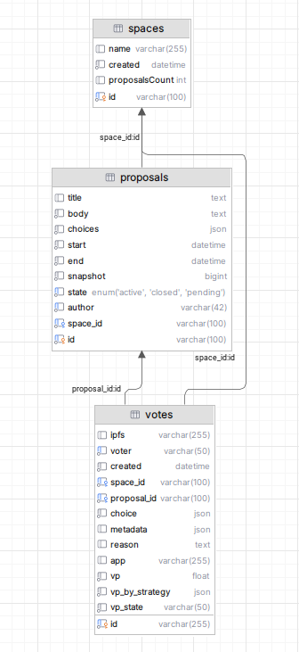

# dao-data-scraping

Scraping DAO data from the blockchain

## Database Schema



## Methodology

All of the data are fetched from the [Snapshot platform](https://snapshot.box/#/explore)

### API Documentation: 
https://docs.snapshot.box/tools/api

### Spaces - Organizations:
Fetching spaces information fron the Snapshot platform can be run using the `scripts/get_spaces.py` program, which will call the `get_snapshot_spaces()` function in `src/repo/snapshot_spaces.py`

The script will repeatly run GraphQL query with an increasing `created_gte` parameter to get all spaces available

Example query
```graphql
query Spaces {
    spaces(
        first: 1000,
        skip: 0,
        where: {
            created_gte: 1746440891
        }
        orderBy: "created",
        orderDirection: asc
    ) {
        id
        name
        created
        proposalsCount
    }
}
```

### Proposals:

Fetching proposals information fron the Snapshot platform can be run using the `scripts/get_proposals.py` program, which will call the `get_snapshot_proposals(space_id)` function in `src/repo/snapshot_proposals.py`

The `space_id` parameter can be retrieved from the `space` table - fetched from Spaces information described above

The script will repeatly run GraphQL query with an increasing `created_gte` parameter to get all proposals available in a space

Example query
```graphql
query Proposals {{
    proposals (
    first: 1000,
    skip: 0,
    where: {{
        created_gte: 1746440891,
        space_in: ["yearn"]
    }}
    orderBy: "created",
    orderDirection: asc
    ) {{
    id
    title
    body
    choices
    start
    end
    snapshot
    state
    author
    }}
}}
```

### Votes

Fetching votes information fron the Snapshot platform can be run using the `scripts/get_votes.py` program, which will call the `get_snapshot_votes(space_id)` function in `src/repo/snapshot_proposals.py`

The `space_id` parameter can be retrieved from the `space` table - fetched from Spaces information described above

The script will repeatly run GraphQL query with an increasing `created_gte` parameter to get all votes available of all proposals belong in a space

Example query
```graphql
query Votes {{
    votes (
    first: 1000,
    skip: 0,
    where: {{
        created_gte: 1746440891,
        space: "yearn"
        proposal_in: "0x000054823c7dbeb822f425bc6a9a339e71f4311fecf3fcba2a9d2a3228e9b40c"
    }}
    orderBy: "created",
    orderDirection: asc
    ) {{
    id
    ipfs
    created
    voter
    space {{
        id
    }}
    choice
    proposal {{
        id
    }}
    metadata
    reason
    vp
    vp_by_strategy
    vp_state
    }}
}}
```

### Votes coalitions

From the database, we can calculate a space's top voters coalitions by running the `scripts/get_snapshot_votes_coalitions.py` program. There are some constants/parameters values need to be defined in the code:
- `SPACE_ID`: retrieved from the database, `space` table
- `VOTER_COUNT_LIMIT`: Defined by researchers, should be a reasonable numbers that these top voters have voted in 25%/50%/75% of proposals count, decided by the researchers

The coalitions between 2 voters is calculated using the `cosine_similarity` function from `sklearn`
```python
for i in range(0, len(top_voters)):
    for j in range(i + 1, len(top_voters)):
        coalitions[i][j] = coalitions[j][i] = float(cosine_similarity([voting_map[top_voters[i]]], [voting_map[top_voters[j]]])[0][0])
```

## Environment variables
To be able to run any scripts, you need to create a new local file named `.env` at the project root that define theses values. For example
```bash
DB_HOST=127.0.0.1
DB_PORT=3306
DB_USER=admin
DB_PASSWORD=password
DB_NAME=dao
```